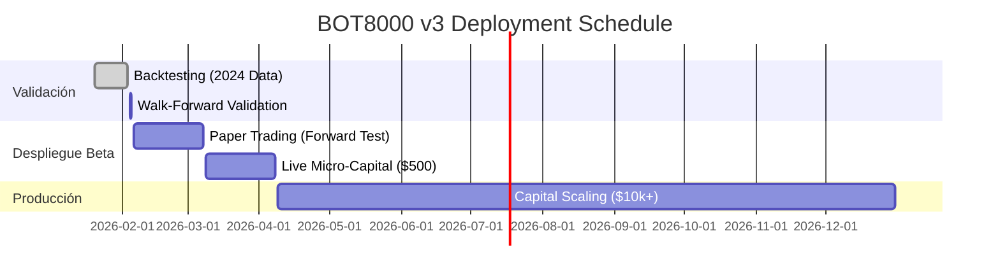

# Roadmap de Despliegue y Escalamiento - BOT8000 v3

Este documento delinea las fases críticas para llevar el sistema MSC v3 de un entorno de desarrollo a producción real.

**Fecha de Inicio:** Febrero 2026
**Estado Actual:** Fase 2 (Validación)

---

## 1. Cronograma de Fases (Timeline)

---

## 2. Detalle de Fases

### ✅ Fase 1: Desarrollo y Backtesting (Completado)

* **Objetivo:** Verificar la lógica del código y la ventaja estadística teórica.
* **Hitos:**
  * Implementación de arquitectura MSC.
  * Corrección de cálculo de indicadores (`ta` lib integration).
  * Resultados Backtest 2024: PF 1.56, WR 53%.

### 🔄 Fase 2: Robustez (En Progreso)

* **Objetivo:** Asegurar que el sistema no está sobreajustado (overfitted) a los datos de 2024.
* **Actividad Principal:** *Walk-Forward Validation*.
* **Criterio de Éxito:**
  * Consistency Score > 75% (3 de cada 4 meses positivos).
  * Average PF Out-of-Sample > 1.2.
  * Drawdown Out-of-Sample < 15%.

### ⏳ Fase 3: Paper Trading (30 Días)

* **Inicio Estimado:** 6 de Febrero, 2026.
* **Objetivo:** Validar la infraestructura de ejecución en tiempo real sin riesgo financiero.
* **Tareas:**
  * Conectar a Binance Testnet.
  * Verificar latencia de datos y ejecución de órdenes.
  * Confirmar que los `fills` simulados coinciden con los precios reales.

### ⏳ Fase 4: Live Micro-Capital (30 Días)

* **Inicio Estimado:** 9 de Marzo, 2026.
* **Objetivo:** Prueba de fuego con "Skin in the game".
* **Capital:** $500 - $1,000 USD reales.
* **Configuración:** Riesgo mínimo (0.5% por trade).
* **Validación:** Psicología del operador y estabilidad del servidor (uptime 99.9%).

### ⏳ Fase 5: Scale Plan

* **Inicio Estimado:** 9 de Abril, 2026.
* **Condición:** Si Fase 4 termina con beneficio neto positivo.
* **Estrategia de Escalamiento:**
  * Mes 1: Capital $5,000. Riesgo 1%.
  * Mes 2: Capital $10,000. Riesgo 1%.
  * Mes 3+: Interés compuesto. Reinvertir 100% de beneficios hasta alcanzar $50k.

---

## 3. Criterios de Aborto (Kill Switch)

El despliegue se detendrá y revertirá a la fase anterior inmediatamente si se cumple cualquiera de las siguientes condiciones:

1. **Error Técnico Crítico:** Fallo en base de datos o API de Binance por > 1 hora.
2. **Divergencia de Ejecución:** Si el precio de entrada real difiere del teórico (slippage) por > 0.2% consistentemente.
3. **Drawdown Acelerado:** Pérdida del 10% del capital en < 1 semana.
4. **Cambio de Régimen Extremo:** Eventos geopolíticos globales que rompen la lógica técnica convencional (e.g., Flash Crashes).
